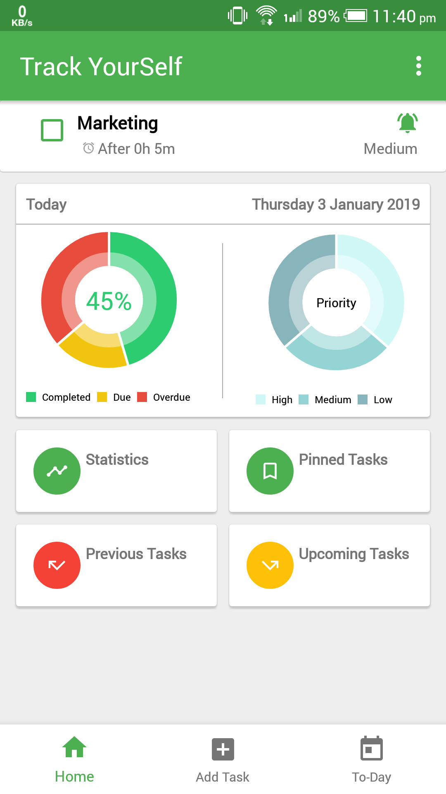
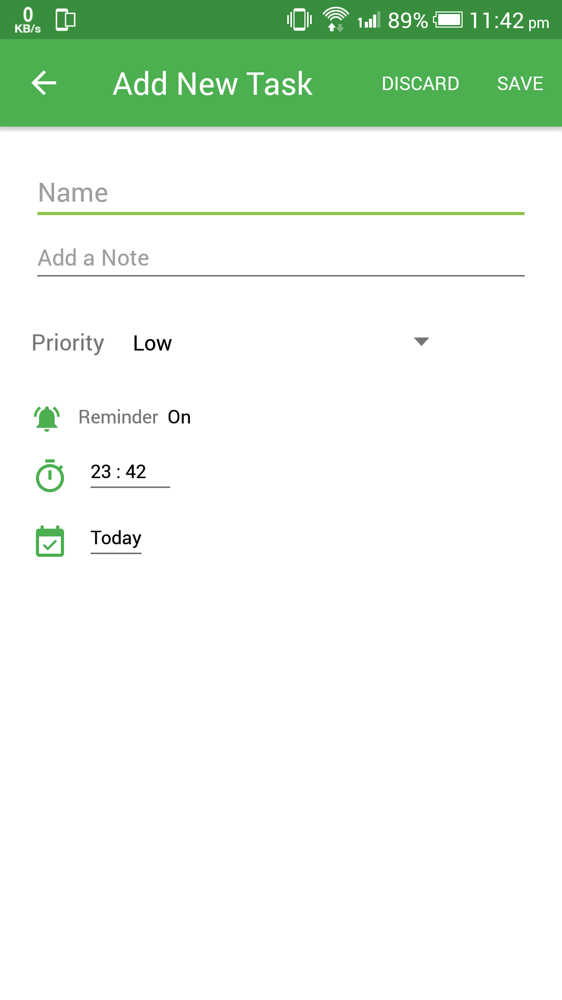
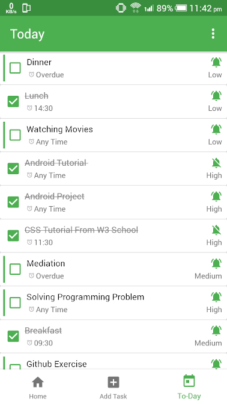
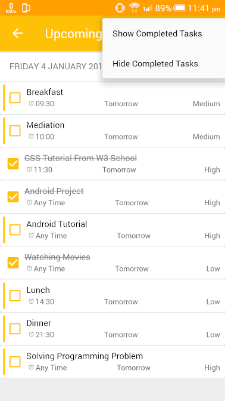
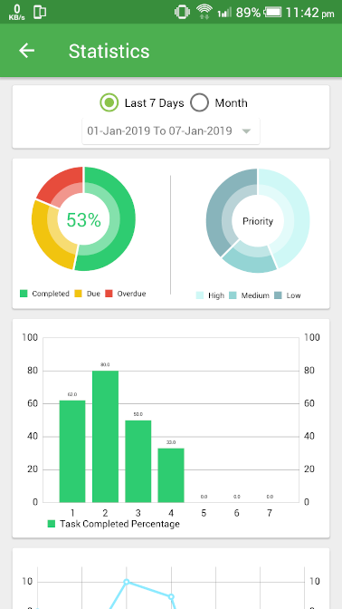
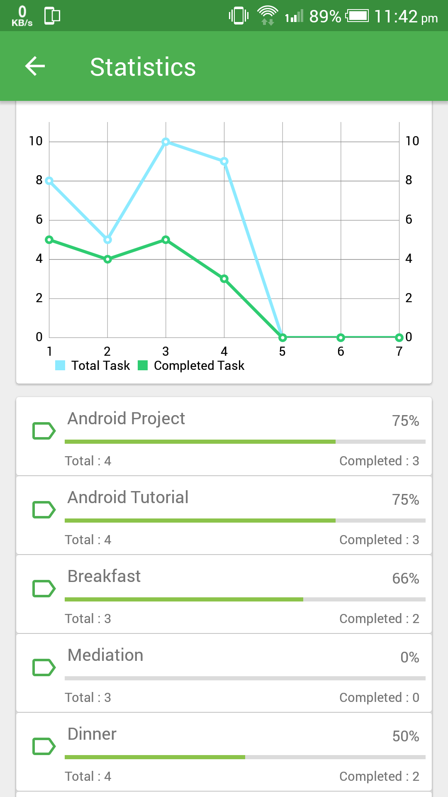

# Track Yourself


Track Yourself is a native android application developed by using java for tracking one's daily activities. User can track his daily activities by making task list and checking completed task. User can get task notification by setting task times with priority. User can view his task completation statistics from Pie Chart, Bar Chart, Line Chart. Chart features are implemented by using thrid-party chart library named MPAndroidChart.
<br>Track Yourself can provide weekly or monthly report about user daily activities. 


### Sample

Dashboard | Add Task
-------------|-----------------
 |  

Today Task_List | Upcomming Task List
-------------|-----------------
 | 

Statistics | Line Chart
-------------|-----------------|-----------------
 |  


### Features:

* User can add task with notes and can set reminder time for task.
* User will get notification when it is time for task or he can mute notification for specific task.
* Can set task time or can leave as "any time". 
* User can set task priority, so that he can prioritize important tasks.
* Application will provide task completation statistics for weekly or monthly.
* Application will provide how many time a specific task was completed by user.


### Used libraries:

* [Constraint Layout](https://developer.android.com/training/constraint-layout)
* [Card View](https://developer.android.com/guide/topics/ui/layout/cardview)
* [Recycler View](https://developer.android.com/guide/topics/ui/layout/recyclerview)
* [MPAndroidChart](https://github.com/PhilJay/MPAndroidChart)


### Developed by:

	Md. Imam Hossain Johny  email: ihjony23@gmail.com


### License

```
Copyright 2019 Imam Hossain

Licensed under the Apache License, Version 2.0 (the "License");
you may not use this file except in compliance with the License.
You may obtain a copy of the License at

   http://www.apache.org/licenses/LICENSE-2.0

Unless required by applicable law or agreed to in writing, software
distributed under the License is distributed on an "AS IS" BASIS,
WITHOUT WARRANTIES OR CONDITIONS OF ANY KIND, either express or implied.
See the License for the specific language governing permissions and
limitations under the License.